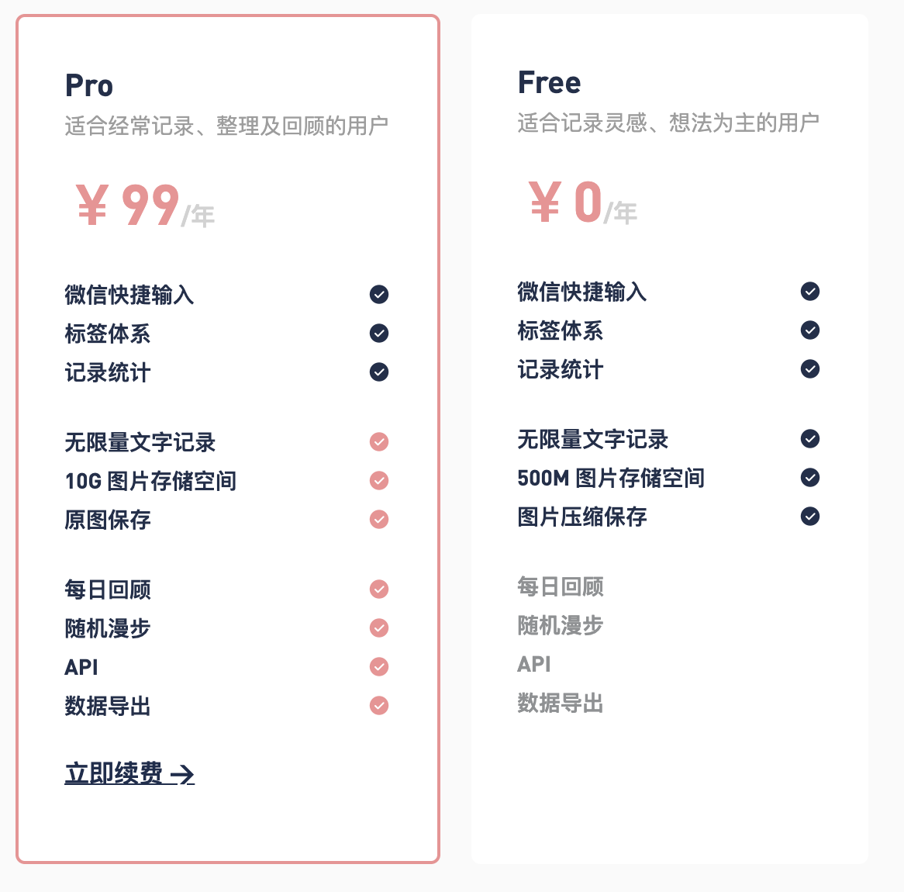

NotionBoy

# What 这是什么

不知道有没有用过 `flomo`, 它的官网是这么介绍的

[🏡 从这里开始](https://help.flomoapp.com)

> flomo 浮墨笔记是什么
flomo是新一代「卡片笔记工具」，秉承尼克拉斯 · 卢曼（Niklas Luhmann）的卡片（Zettelkasten）笔记法理念，让你能更好的利用碎片时间积累知识，建立知识间的关联。

我很喜欢使用 flomo，它带给我的帮助很多，使用也非常方便

- 随时记录灵感
- 直接使用微信，Telegram 或者其它的工具进行输入
- 支持标签搜索

但是它有一个致命的问题，我的数据不是我的，我得开会员才能导出我的数据，如图

虽然付费可以导出，但是我还是有一丝不爽，再者我是一个重度 Notion 用户，所以我的数据基本都是放在 Notion 上的，所以也不想再用一个 App 来记录内容。于是就趁机研究来一下 Notion 新发布的 API （[https://developers.notion.com](https://developers.notion.com/)），研究了一下，就想到要做一个属于自己的功能类似于 flomo 的应用。

说干就干，但是如果只是在 Notion 里面做记录，那是完全不够的，因为 Notion 太慢了，有时候等我打开 Notion 的那个页面，我的想法已经消失了😅。所以 NotionBoy 需要快，所以借鉴 flomo，我希望可以像 flomo 一样，直接在微信或者 Telegram 这种社交软件上进行输入。于是研究了一下微信公众号，知道服务号才能和联系人一样，在微信主界面显示，但个人不允许申请服务号，因此为了这个项目，不得不注册了一个个体户，这样有了营业执照，然后申请了服务号。

最终，经过这些准备工作，和少量的开发之后，`NotionBoy`  面世了。

已实现的功能：

- 关注微信公众号后，绑定自己的 Notion
- 像聊天一样，随时记录自己的想法
- 支持 # 作为标识符，自定义标签🏷️
- 所有的笔记都存储在你绑定的 Notion 上

# How 如何使用

## 使用 NotionBoy 需要三步

### 获取 Notion Token

跟着官方教程走一遍，保留两个值 `Token`  和 `DatabaseID`

[Start building with the Notion API](https://developers.notion.com/docs/getting-started)

主要步骤如下：

1. 进入 [https://www.notion.com/my-integrations](https://www.notion.com/my-integrations) 
2. 新建集成机器人，输入名字（这个随便输入都行）
3. 选择一个想机器人写入的 Workspace （可以新建一个，如果担心数据安全问题）
4. 点击确定之后，就会看到 `Internal Integration Token`，Token 以 `secret_` 开头，复制并保存这个 Token，后面需要使用
5. 光有 Token 还不行，还需要具体的 DatabaseID，制定数据写到什么地方，下面就需要获取 DatabaseID
6. 打开 Notion，在第 3 步选择的 Workspace 里面新建一个页面，或者直接在已有的页面里面，新建一个数据库，输入 `/table` , 然后选择 `full page table`
7. 这样数据库就建好了，下面给机器人操作这个数据库的权限，在刚刚创建的数据库页面右上角，点击 Share 并选择 Invite，把我们前面创建的机器人邀请进我们的数据表中。现在机器人可以对这个数据库进行读写等操作了。
8. 获取 DatabaseID，复制这个数据库页面的 URL，类似 [`https://www.notion.so/myworkspace/a8aec43384f447ed84390e8e42c2e089?v=](https://www.notion.so/a8aec43384f447ed84390e8e42c2e089)...` 这种，这里面的 `a8aec43384f447ed84390e8e42c2e089` 就是 DatabaseID
9. 到这就完成了 Token 和 DatabaseID 的获取了，虽然写的比较多，但是实际很简单

可以参考官方动图 

### 绑定微信公众号

微信搜索 `NotionBoy` 并且关注，或者直接扫码关注

关注之后，会提示绑定

> 欢迎使用 Notion Boy，您还未绑定。
如需绑定，请在 1 分钟之内，按照下面的格式回复 Notion 的 Token 和 DatabaseID 来绑定
获取 Token 和 DatabaseID 的相关方法，请参考官方文档 [https://developers.notion.com/docs/getting-started](https://developers.notion.com/docs/getting-started)
Token 是以 "secret_" 开头的字符串，
DatabaseID 则是分享的 Page 链接的后半部分
--- 下面是具体的格式 ---
Token: secret_xxx
DatabaseID: xxxx

我们把 上面获取的的 Token 和 DatabaseID 按照格式回复就行，如图

### 开始记录你的想法

记录想就和聊天一样，如果想把这条记录归类，可以加上 #作为标签，不加没有任何影响，支持任意位置多个 #标签。如图

# DevPlan 未来的开发计划

暂时未计划太多，平常使用的最多的就是微信和 Telegram，所以想先支持这两个，未来如果有时间可以开发更多的，比如 slack，teams， 甚至 email 等作为输入。

还有需要做的是，这个是免费运营的，现在在我的服务器上，后期会改成 serverless 的方式，使其可以长期运营下去

- [x]  支持微信输入
- [x]  支持多标签
- [ ]  支持 Telegram 输入
- [ ]  使用 serverless 改写代码，并部署
- [ ]  优化代码，提高代码质量
- [ ]  。。。

# Q&A 问答

1. Q: 这个是否抄袭 flomo ？

    A: 这个也是我非常关心的，理念上，我完全承认我抄袭，毕竟 flomo 是非常创新，也非常好的产品，我的本意是想做一个方便自己使用的，但是我觉得分享出来也更好。如果 flomo 方面真的觉得我抄袭，可以通知我，我会主动关闭，只给自己使用。

2. Q: 数据安全吗？

    A: 数据完全保留在 Notion 上，除了必须要保存的 Notion Token 和 DatabaseID，我这边不会保存任何的数据，所有的记录都会完整的保存在 Notion 上。

3. Q: 我想解除绑定 Notion，改怎么做？

    A: 直接在公众号上回复 「解绑」，就可以解绑了

4. Q: 我想更换绑定的 Notion，改怎么做？

    A: 公众号回复 「绑定」，就可以重新绑定了，如果绑定成功才能更换，绑定不成功就会维持原来的不变