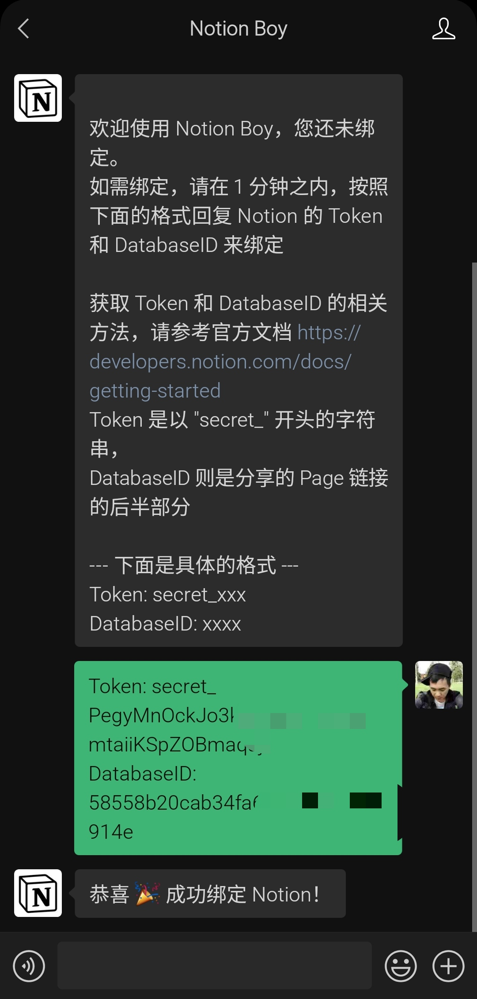
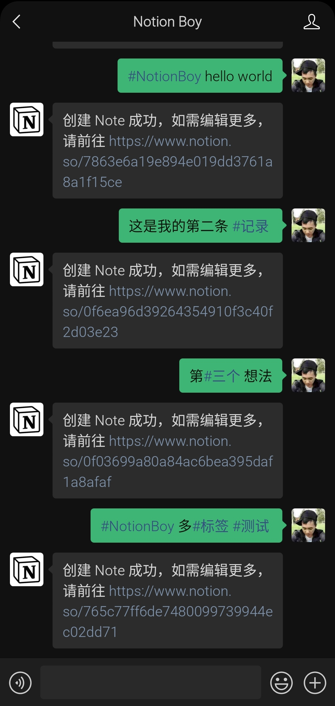
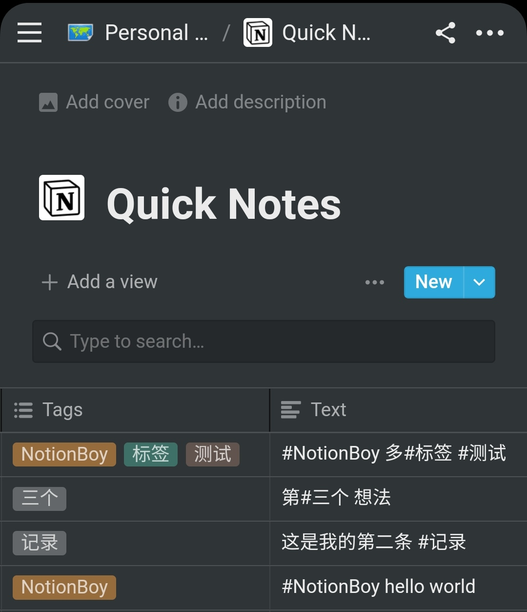

# NotionBoy

Notion Boy 是一个基于微信公众号和 Notion 快速笔记应用。

完整介绍可以参考 [NotionBoy 的前世今生](https://www.theboys.tech/notion-boy)

---
## 使用 NotionBoy 需要三步

### 获取 Notion Token

跟着官方教程走一遍，得到两个值 `Token`  和 `DatabaseID`

[Start building with the Notion API](https://developers.notion.com/docs/getting-started)

主要步骤如下：

1. 获取 `Token`
    1. 进入 [https://www.notion.com/my-integrations](https://www.notion.com/my-integrations) 
    2. 新建集成机器人，输入名字（这个随便输入都行）
    3. 选择一个想机器人写入的 Workspace （可以新建一个，如果担心数据安全问题）
    4. 点击确定之后，就会看到 `Internal Integration Token`，Token 以 `secret_` 开头，复制并保存这个 Token，后面需要使用
2. 获取 `DatabaseID`
    1. 光有 Token 还不行，还需要具体的 DatabaseID，制定数据写到什么地方，下面就需要获取 DatabaseID
    2. 打开 Notion，在第 3 步选择的 Workspace 里面新建一个页面，或者直接在已有的页面里面，新建一个数据库，输入 `/table` , 然后选择 `full page table`
    3. 这样数据库就建好了，下面给机器人操作这个数据库的权限，在刚刚创建的数据库页面右上角，点击 Share 并选择 Invite，把我们前面创建的机器人邀请进我们的数据表中。现在机器人可以对这个数据库进行读写等操作了。
    4. 获取 DatabaseID，复制这个数据库页面的 URL，类似 [`https://www.notion.so/myworkspace/a8aec43384f447ed84390e8e42c2e089?v=](https://www.notion.so/a8aec43384f447ed84390e8e42c2e089)...` 这种，这里面的 `a8aec43384f447ed84390e8e42c2e089` 就是 DatabaseID
9. 到这就完成了 Token 和 DatabaseID 的获取了

可以参考官方动图 

### 绑定微信公众号

微信搜索 `NotionBoy` 并且关注，或者直接扫码关注

关注之后，会提示绑定

> 欢迎使用 Notion Boy，您还未绑定。
如需绑定，请在 1 分钟之内，按照下面的格式回复 Notion 的 Token 和 DatabaseID 来绑定
获取 Token 和 DatabaseID 的相关方法，请参考官方文档 [https://developers.notion.com/docs/getting-started](https://developers.notion.com/docs/getting-started)
Token 是以 "secret_" 开头的字符串，
DatabaseID 则是分享的 Page 链接的后半部分
--- 下面是具体的格式 ---
Token: secret_xxx,DatabaseID: xxxx

我们把 上面获取的的 Token 和 DatabaseID 按照格式回复就行，如图

### 开始记录你的想法

记录想就和聊天一样，如果想把这条记录归类，可以加上 #作为标签，不加没有任何影响，支持任意位置多个 #标签。如图

